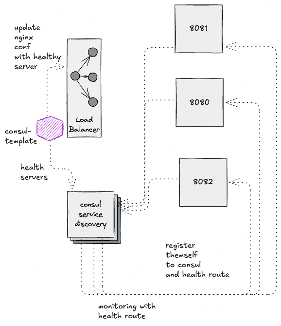

# Service Discovery with Consul and Nginx

This project demonstrates a simple service discovery and load balancing setup using Consul and Nginx. It includes:
- Multiple instances of a Go service
- Consul for service discovery and health checks
- Nginx for load balancing

## Features

- **Service Discovery**: Services automatically register with Consul
- **Health Checks**: Consul monitors service health
- **Load Balancing**: Nginx distributes traffic to healthy services
- **DNS-based Discovery**: Nginx uses Consul's DNS interface

## How It Works

1. **Service Registration**:
   - Each service instance registers with Consul
   - Services include health check endpoints
   - Consul monitors service health and down server whenever health check fail

2. **Load Balancing**:
   - there is consul-template, which listen the consul 
   - and dynamically generate the nginx.conf, whenever there is change
   - and restart the reload nginx -> script -> consul-template.hcl 
   - Automatically routes to healthy services
   - No manual configuration needed

3. **Health Checking**:
   - Consul performs health checks
   - Unhealthy services are automatically removed
   - Services are added back when healthy

## Configuration

- **Consul**: Running on port 8500 (UI) 
- **Nginx**: Running on port 80
- **Services**: Running on ports 8080, 8081, and 8082

## Development
- gvm use go1.16
- download consul-template
- go mod tidy
- go mod vendor
- docker-compose up -d
- Main service via nginx: http://localhost
- Consul UI: http://localhost:8500
- run command ->   consul-template -config=./nginx/consul-template.hcl -> in background
- stop some server
- and see updated nginx

